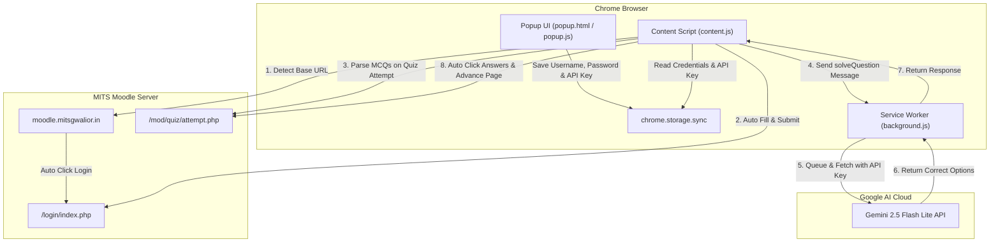

# 🎓 MITS Moodle Auto Login & AI Quiz Assistant

[](https://developer.chrome.com/docs/extensions/mv3/intro/)
[](https://aistudio.google.com/)
[](https://github.com/Ramanand-tomar/Moodle-Chrome-extension)
[](LICENSE)
[](https://moodle.mitsgwalior.in/)

> A powerful, privacy-first Chrome Extension for students at **Madhav Institute of Technology & Science (MITS), Gwalior**. Automates seamless single-click logins to Moodle and features an integrated **AI Quiz Solver** powered by Google Gemini 2.5 Flash Lite.

---

## 📌 Table of Contents

- [Overview](#-overview)
- [Key Features](#-key-features)
- [Architecture & Workflow](#-architecture--workflow)
- [Installation Guide](#-installation-guide)
- [Setup & Usage](#-setup--usage)
  - [1. Setting Up Auto Login](#1-setting-up-auto-login)
  - [2. Setting Up Gemini AI Quiz Solver](#2-setting-up-gemini-ai-quiz-solver)
  - [3. Using the AI Quiz Solver](#3-using-the-ai-quiz-solver)
- [Project Structure](#-project-structure)
- [Security & Privacy](#-security--privacy)
- [Troubleshooting & FAQ](#-troubleshooting--faq)
- [Disclaimer](#-disclaimer)
- [License](#-license)

---

## 🌟 Overview

Repeatedly entering credentials on Moodle or manually clicking through course portals wastes valuable time every day. **MITS Moodle Auto Login** automates your entire authentication sequence while keeping your password stored strictly inside your browser. 

In addition, Version 2.0 introduces the **AI Quiz Solver**, an autonomous assistant embedded directly into Moodle quiz pages (`/mod/quiz/attempt.php`) that parses multiple-choice questions, queries Google Gemini 2.5 Flash Lite via a rate-limited background queue, inputs correct answers, and navigates between pages seamlessly.

---

## 🔥 Key Features

### ⚡ Seamless Auto-Login
- **Zero-Click Authentication**: Navigates from `moodle.mitsgwalior.in` directly to `/login/index.php`, auto-fills credentials, and logs you into your dashboard (`/my/`).
- **Smart DOM Polling**: Handles slow page loads gracefully with robust polling intervals and status detection.
- **Error Handling**: Detects incorrect credentials or failed attempts and notifies you directly via lightweight on-page toasts.

### 🤖 AI Quiz Solver (Powered by Google Gemini 2.5)
- **Automatic Page Parsing**: Identifies single-choice (radio button) and multiple-choice (checkbox) questions directly on Moodle attempt pages.
- **Smart Gemini Integration**: Leverages `gemini-2.5-flash-lite` for near-instant response times and high accuracy.
- **Queueing & Rate-Limit Guard**: Implements a promise queue with automatic retry exponential backoff (`HTTP 429` protection).
- **Auto-Navigation**: Automatically clicks **"Next Page"** after answering and safely stops at the **Summary Page** (`/mod/quiz/summary.php`) so you can review before submitting.

### 🎨 Modern Glassmorphic Interface
- Built with high-contrast dark mode, vibrant gradients, dynamic blur background effects, and status indicators.
- One-click management to save, update, or remove credentials and your Gemini API key.

### 🔒 Privacy & Security First
- Credentials and API keys are saved exclusively in Chrome's encrypted local sync storage (`chrome.storage.sync`).
- Zero third-party telemetry, tracking, or remote database dependencies.

---

## 🏗️ Architecture & Workflow



---

## 🚀 Installation Guide

### Prerequisites
- Google Chrome, Microsoft Edge, Brave, or any Chromium-based browser supporting **Manifest V3**.

### Steps (Developer Mode)

1. **Clone the Repository**:
   ```bash
   git clone https://github.com/Ramanand-tomar/Moodle-Chrome-extension.git
   ```
2. **Open Extensions Manager**:
   - Open Chrome and navigate to `chrome://extensions/` in your address bar.
3. **Enable Developer Mode**:
   - Toggle the **Developer mode** switch located in the top-right corner of the page.
4. **Load Unpacked Extension**:
   - Click the **Load unpacked** button.
   - Select the folder containing this repository (where `manifest.json` is located).
5. **Pin Extension**:
   - Click the puzzle icon in Chrome's top toolbar and pin **MITS Moodle Auto Login** for easy access.

---

## ⚙️ Setup & Usage

### 1. Setting Up Auto Login

1. Click the extension icon in your Chrome toolbar to open the popup.
2. Enter your MITS Moodle **Username** and **Password**.
3. Click **Save & Continue**.
4. Visit [moodle.mitsgwalior.in](https://moodle.mitsgwalior.in/). The extension will automatically log you in!

---

### 2. Setting Up Gemini AI Quiz Solver

1. Obtain a free API key from [Google AI Studio](https://aistudio.google.com/app/apikey).
2. Open the extension popup menu.
3. Under **AI Quiz Solver**, paste your API key into the key field.
4. Click **Save Key**. The indicator will change to **Key saved**.

---

### 3. Using the AI Quiz Solver

1. Navigate to any Moodle quiz attempt page (e.g., `https://moodle.mitsgwalior.in/mod/quiz/attempt.php?...`).
2. A floating button **`🤖 Solve Quiz with AI`** will appear at the bottom-right of your screen.
3. Click the button to start. The extension will:
   - Read the question and options on the page.
   - Send the prompt to Gemini AI.
   - Select the corresponding answer choice(s).
   - Click **Next Page** automatically.
4. Once all questions are solved, the solver will pause on the quiz summary page (`/mod/quiz/summary.php`), giving you full control to click **Submit all and finish**.

---

## 📁 Project Structure

```
Moodle-Chrome-extension/
├── manifest.json       # Chrome Extension Manifest V3 configuration
├── background.js       # Background service worker & Gemini API rate-limited client
├── content.js          # DOM manipulation for auto-login & Moodle quiz solver
├── popup.html          # Extension popup UI (Glassmorphic dark design)
├── popup.js            # Popup logic for managing credentials & API keys
├── image.jpg           # Extension icon / branding asset
└── README.md           # Documentation
```

---

## 🔒 Security & Privacy

- **Data Locality**: All stored credentials and API keys reside inside Chrome's isolated extension storage (`chrome.storage.sync`).
- **No Third-Party Analytics**: No user tracking, external loggers, or telemetry trackers are integrated.
- **Direct Communication**: Gemini API calls are made directly from your browser background worker straight to `generativelanguage.googleapis.com` using your personal API key.

---

## ❓ Troubleshooting & FAQ

<details>
<summary><b>1. Extension reloaded error during quiz solving?</b></summary>
If you reloaded or updated the extension while a quiz page was open, Chrome invalidates the active content script context. Simply press <b>F5</b> to refresh the Moodle quiz page and click <b>Solve Quiz with AI</b> again.
</details>

<details>
<summary><b>2. "HTTP 429: Rate limit exceeded" error?</b></summary>
The Gemini API free tier limits request frequency. The extension automatically queues requests with a 4.5s delay and retries after a backoff period. If rate limits persist, consider checking your quota in Google AI Studio.
</details>

<details>
<summary><b>3. Auto-login is not filling credentials?</b></summary>
Ensure that your login credentials are properly saved in the popup interface. If Moodle updates its HTML input IDs, ensure the page has completely loaded or update the extension to the latest commit.
</details>

---

## ⚠️ Disclaimer

This Chrome Extension is created independently for **educational purposes** by students of MITS Gwalior. It is not officially affiliated with or endorsed by MITS Gwalior or Moodle Pty Ltd. Use responsibly and adhere to your academic institution's code of conduct and academic integrity policies.

---

## 📄 License

Distributed under the [MIT License](LICENSE). Feel free to modify and distribute as permitted under the license terms.
